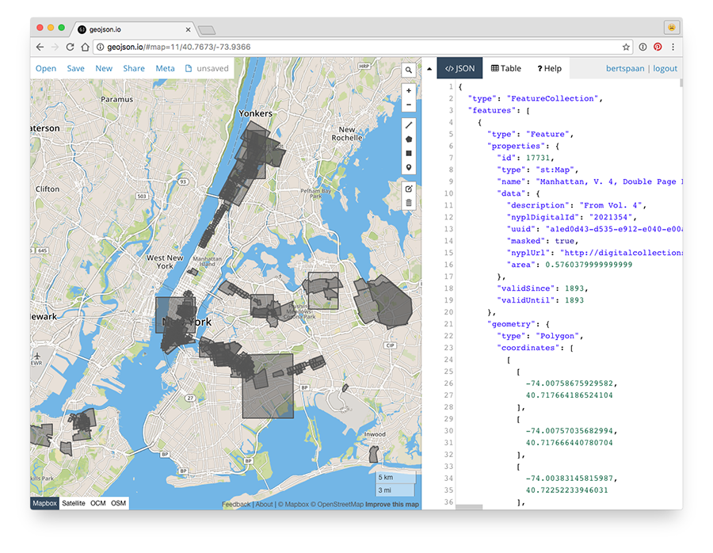

# NYC Space/Time Directory - Data & Tools

This repository lists resources useful when working with [NYC Space/Time Directory](http://spacetime.nypl.org/) data.

## Datasets

See http://spacetime.nypl.org/#data

## Ontology

See https://github.com/nypl-spacetime/ontology

## Tools

- Space/Time command line tools: https://github.com/nypl-spacetime/spacetime-cli

## Examples

The examples below use the following tools:

- [jq](https://stedolan.github.io/jq/): command-line JSON processor, install with `brew install jq`
- [ndjson-cli](https://github.com/mbostock/ndjson-cli): command-line tools for operating on newline-delimited JSON streams, install with `npm install -g ndjson-cli`
- [spacetime-cli](https://github.com/nypl-spacetime/spacetime-cli): command-line tools for Space/Time data, install with `npm install -g nypl-spacetime/spacetime-cli`

## Convert Space/Time data to JSON

Download Space/Time [Map Warper](http://maps.nypl.org) data and convert to JSON array:

    curl http://s3.amazonaws.com/spacetime-nypl-org/datasets/mapwarper/mapwarper.pits.ndjson | spacetime-to-json

Use jq to only display the ID and the area the map depicts:

    curl http://s3.amazonaws.com/spacetime-nypl-org/datasets/mapwarper/mapwarper.pits.ndjson | spacetime-to-json | jq '.[] | {id: .id, area: .data.area}'

Use ndjson-map to only display the ID and the name, and then grep for *Harlem*:

    curl http://s3.amazonaws.com/spacetime-nypl-org/datasets/mapwarper/mapwarper.pits.ndjson | ndjson-map '`${d.id} - ${d.name}`' | grep Harlem

## Convert Space/Time data to GeoJSON

Download Map Warper data, filter maps which title includes *broadway*, convert to GeoJSON and copy to clipboard:

    curl http://s3.amazonaws.com/spacetime-nypl-org/datasets/mapwarper/mapwarper.pits.ndjson | ndjson-filter 'd.name && d.name.toLowerCase().includes("broadway")' | spacetime-to-geojson | pbcopy

Then, we can paste this GeoJSON data into [geojson.io](http://geojson.io/):

